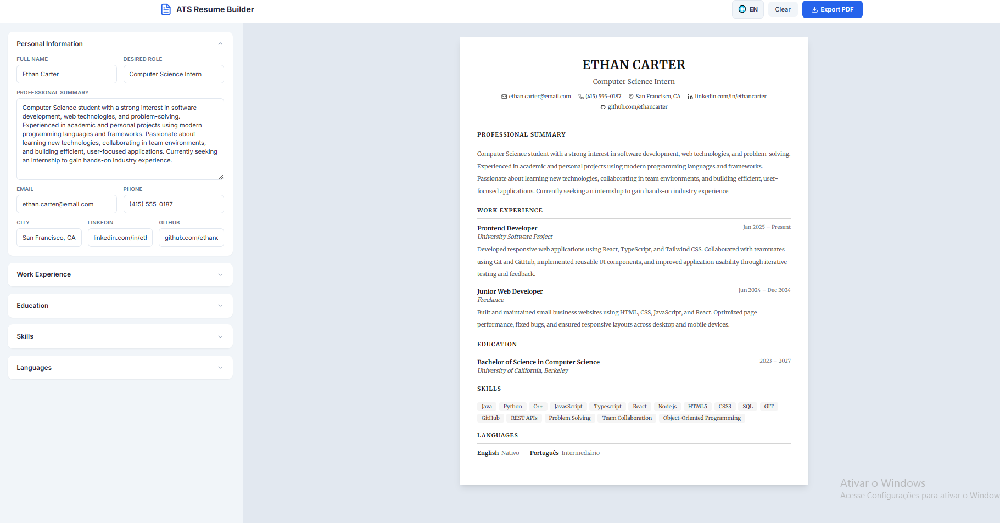

<div align="center">

# 📄 ATS Resume Builder

### Gerador de Currículos Otimizado para Sistemas ATS

[](https://react.dev/)
[](https://www.typescriptlang.org/)
[](https://vitejs.dev/)
[](https://tailwindcss.com/)
[](LICENSE)

<p align="center">
  
  
</p>

</div>

---

## 📖 Sobre o Projeto

O **ATS Resume Builder** é uma aplicação web moderna que permite criar currículos profissionais otimizados para **Sistemas ATS** (Applicant Tracking Systems). Esses sistemas são utilizados por empresas para filtrar e classificar currículos automaticamente, por isso a formatação correta é essencial para passar pelos filtros.

Este projeto foi desenvolvido como um **MVP (Produto Mínimo Viável)** com foco em:

- ✅ **Simplicidade** — Interface limpa e intuitiva
- ✅ **Pré-visualização em tempo real** — Veja as alterações instantaneamente
- ✅ **Template ATS Friendly** — Layout otimizado para parsers de currículo
- ✅ **Exportação PDF** — Download em formato A4 profissional
- ✅ **Persistência local** — Dados salvos automaticamente no navegador
- ✅ **Suporte a idiomas** — Interface e documento em Português ou Inglês

---

## 🎥 Demonstração

<div align="center">



*Interface em inglês com pré-visualização do currículo em tempo real*

</div>

---

## 🚀 Tecnologias Utilizadas

| Tecnologia | Versão | Descrição |
|:---|:---:|:---|
| [React](https://react.dev/) | 18.3 | Biblioteca para construção de interfaces |
| [TypeScript](https://www.typescriptlang.org/) | 5.5 | Superset JavaScript com tipagem estática |
| [Vite](https://vitejs.dev/) | 5.3 | Build tool ultrarrápida para desenvolvimento |
| [Tailwind CSS](https://tailwindcss.com/) | 3.4 | Framework CSS utilitário |
| [html2pdf.js](https://ekoopmans.github.io/html2pdf.js/) | 0.10 | Biblioteca para exportação de HTML para PDF |

---

## ✨ Funcionalidades

### Dados Pessoais
- Nome completo
- Cargo desejado
- Resumo profissional
- E-mail, telefone e cidade
- LinkedIn e GitHub

### Formação Acadêmica
- Adicione múltiplas formações
- Instituição, curso e período

### Experiência Profissional
- Adicione múltiplas experiências
- Empresa, cargo, período e descrição detalhada

### Habilidades
- Sistema de tags interativo
- Digite e pressione Enter para adicionar

### Idiomas
- Lista com nível de proficiência
- Opções: Básico, Intermediário, Avançado, Fluente, Nativo

### 🌐 Suporte a Idiomas
Alterne entre **Português (PT)** e **Inglês (EN)** com um clique. Toda a interface e os tópicos do currículo são traduzidos automaticamente:

| Português | Inglês |
|:---|:---|
| Resumo Profissional | Professional Summary |
| Experiência Profissional | Work Experience |
| Formação Acadêmica | Education |
| Habilidades | Skills |
| Idiomas | Languages |

### Template ATS Friendly
- ✅ Layout em coluna única
- ✅ Sem tabelas ou elementos gráficos complexos
- ✅ Hierarquia clara de títulos (`h1`, `h2`, `h3`)
- ✅ Fontes legíveis e profissionais
- ✅ Organização lógica das informações

### Exportação PDF
- Formato A4 profissional
- Formatação preservada
- Nome do arquivo personalizado

### Responsividade
- 💻 **Desktop** — Painel dividido (edição + pré-visualização)
- 📱 **Tablet** — Layout adaptativo
- 📲 **Mobile** — Toggle entre editar e visualizar

---

## 📦 Instalação e Uso

### Pré-requisitos
- [Node.js](https://nodejs.org/) >= 18.0
- [npm](https://www.npmjs.com/) ou [yarn](https://yarnpkg.com/)

### Passo a passo

```bash
# 1. Clone o repositório
git clone https://github.com/KelvinOliveiraCode/ats-resume-builder.git

# 2. Acesse o diretório do projeto
cd ats-resume-builder

# 3. Instale as dependências
npm install

# 4. Inicie o servidor de desenvolvimento
npm run dev

# 5. Abra no navegador
# http://localhost:5173
```

### Build para produção

```bash
npm run build
```

O resultado será gerado na pasta `dist/`.

---

## 📁 Estrutura do Projeto

```
ats-resume-builder/
├── public/                 # Arquivos estáticos
├── src/
│   ├── components/         # Componentes React
│   │   ├── icons/          # Ícones SVG reutilizáveis
│   │   ├── Section.tsx     # Componente de seção colapsável
│   │   ├── Input.tsx       # Campo de input reutilizável
│   │   ├── PersonalForm.tsx
│   │   ├── EducationForm.tsx
│   │   ├── ExperienceForm.tsx
│   │   ├── SkillsForm.tsx
│   │   ├── LanguagesForm.tsx
│   │   └── ResumePreview.tsx
│   ├── types/              # Tipagens TypeScript
│   │   └── index.ts
│   ├── hooks/              # Custom React Hooks
│   │   └── useLocalStorage.ts
│   ├── utils/              # Funções utilitárias
│   │   ├── exportPDF.ts
│   │   └── demoData.ts
│   ├── styles/             # Estilos globais
│   │   └── global.css
│   ├── App.tsx             # Componente principal
│   └── main.tsx            # Entry point
├── screenshot.png          # Screenshot da aplicação
├── index.html
├── package.json
├── tsconfig.json
├── vite.config.ts
├── tailwind.config.js
├── postcss.config.js
└── README.md
```

---

## 🛣️ Roadmap

- [x] MVP funcional com todos os campos essenciais
- [x] Exportação para PDF
- [x] Persistência no localStorage
- [x] Layout responsivo
- [x] Suporte a idiomas (PT/EN)
- [ ] Validação de campos com React Hook Form + Zod
- [ ] Múltiplos templates de currículo
- [ ] Análise ATS (verificador de palavras-chave)
- [ ] Reordenação drag-and-drop de seções
- [ ] Modo escuro na interface de edição
- [ ] Suporte a múltiplos idiomas (i18n completo)
- [ ] Deploy automático com GitHub Actions

---

## 🤝 Como Contribuir

1. Faça um **fork** do projeto
2. Crie uma **branch** para sua feature (`git checkout -b feature/nova-feature`)
3. Faça **commit** das suas alterações (`git commit -m 'Adiciona nova feature'`)
4. Faça **push** para a branch (`git push origin feature/nova-feature`)
5. Abra um **Pull Request**

---

## 📝 Licença

Este projeto está licenciado sob a licença MIT — veja o arquivo [LICENSE](LICENSE) para mais detalhes.

---

## 👨‍💻 Desenvolvedor

<table>
  <tr>
    <td align="center">
      <a href="https://github.com/KelvinOliveiraCode">
        
        <br />
        <sub><b>Kelvin Oliveira</b></sub>
      </a>
      <br />
      <sub>Full Stack Developer</sub>
    </td>
  </tr>
</table>

<div align="center">

### 🌐 Conecte-se comigo

[](https://github.com/KelvinOliveiraCode)
[](https://www.linkedin.com/in/kelvin-oliveira-0282033b4/)
[](https://web.dio.me/users/kelvinrebelosw)

</div>

---

<div align="center">

⭐ Se este projeto te ajudou, deixe uma estrela no repositório!

**Feito com 💙 por [Kelvin Oliveira](https://github.com/KelvinOliveiraCode)**

</div>
